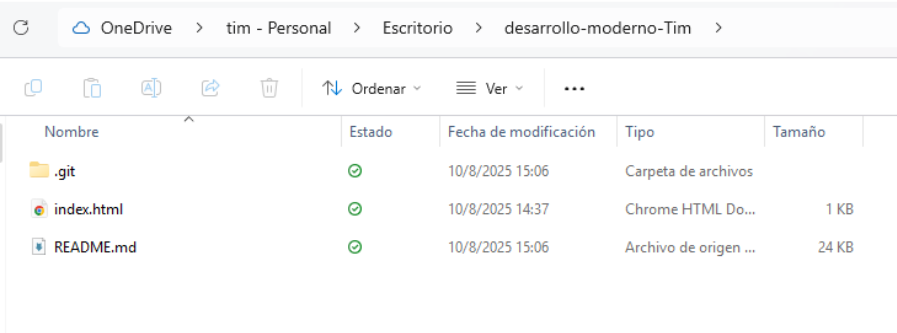

# Características del desarrollo web moderno

## Frameworks de desarrollo web
###### ¿Qué es un framework y qué problema resuelve?
**Dentro del mundo del desarrollo de software un framework es una estructura de trabajo que implementa modulos concretos de software los cuales estan enfocados en desarrollo y y organización del mismo.**

**Algunos de los problemas que son resuletos por el uso de frameworks se encuentra: la estandarización de código, la reutilización de componentes, la aceleración del desarrollo y la mejora de la seguridad**
###### https://es.wikipedia.org/wiki/Framework


###### Arquitectura general y enfoque
**AngularJS es un framework de JavaScript que utiliza el modelo MVC para organizar su estructura facilitando el desarrollo y enfoque, implementando test unitarios y enlazamiento de codigo con el HTML.**

**En Angular el Modelo representa los datos y la lógica de negocio de la aplicación. Es responsable de la manipulación de datos, así como de la recuperación, el almacenamiento y el procesamiento de los datos de la aplicación**

**En angular la vista se define mediante plantillas HTML qu utilizan directivas como ng-model, ng-bind y ng-repeat.**

**El controlador es definido mediente funciones JavaScript, estas estan encargadas de procesar la información de usuario proveniente de la vista.**
###### https://www.angularminds.com/blog/mvc-pattern-explained-in-angularjs

###### Ejemplo práctico documentado
**En agnular los componentes estan compuestos por 3 documentos:**

1. HTML - Maneja de manera general la vista de los componentes.
2. CSS - Archivo encargado de contener y manejar los estilos del los componentes.
3. TypeScript – El archivo que contiene la lógica del programa.

En el siguiente ejemplo se puede apreciar como angular implementa el comportamiento de sus componentes.
El boton que se encuentra en el HTML tiene el evento click el cual llama a la funcion incrementarContador() del archivo app.component.ts, la cual tiene una funcionalidad de incrementador de cantidades. Mostrando en pantalla una cantidad númerica que aumenta.

#### app.component.ts
```
import { Component } from '@angular/core';

@Component({
  selector: 'app-root',
  templateUrl: './app.component.html',
  styleUrls: ['./app.component.css']
})
export class AppComponent {
  title = 'Mi primera app Angular';
  contador = 0;

  incrementarContador() {
    this.contador++;
  }
}
```

#### app.component.html
```
<h1>{{ title }}</h1>
<p>Has hecho clic {{ contador }} veces.</p>
<button (click)="incrementarContador()">Haz clic</button>
```
###### https://angular.io/tutorial


###### Comparación breve entre al menos dos frameworks
En la siguiente sección se desea realizar una comparativa entra Angular y Nextjs

#### Arquitectura
Dentro de las diferencias que podemos encontrar, se encuentra la arquitectura. Mientra angular se enfoca en un modelo MVC basado en modelo dividido en componentes, modulos y servicios encargados de interfaz de usuario, funcionalidad y gestión y manejo de datos. Next.js utiliza un modelo basado en paginas, componentes y rutas API, que manejan rutas, elementos reutilizables de interfaz y el menejo de la logica de los servicios.
#### Curva de aprendizaje
Angular es un framework muy robusto que cuenta con una curva de aprendizage alta a la que se suma la dependencia de typescript. Por otra parte Next.js es más ligero en este aspecto, utilza js como lenguaje principal no necesita demasiadas configuraciones y contiene un conjunto de herramientas potentes para desarrollar.

###### https://dev.to/hitesh_developer/angular-vs-nextjs-a-detailed-comparison-34ki

## Control de versiones y trabajo colaborativo
###### ¿Qué es el control de versiones y por qué es esencial?
Son soluciones de software que ayudan a hacer el seguimiento de los cambios de un proyecto con el tiempo. A medida que se van realizando cambios estos pueden ser almacenado en caso de que en el futuro se desee regresar a una instancia anterior en el proceso de desarrollo de un proyecto.

La esencialidad de un software de control de versiones en el desarrollo de una soluciones programadas redica en la utilidad que esta puede suponer para los desarrolladores al momento de que se produscan errores o se experimente con herramientas nuevas, estas tecnologias ayudan a diferentes equipos a hacer trabajos más escalables al mismo tiempo.
###### https://learn.microsoft.com/es-es/devops/develop/git/what-is-version-control
###### Conceptos clave
1. Repositorio: Lugar en el que se almacena el historial de cambios, puede ser local o remoto y se registran los cambios pertenecientes a las versiones anteriores.
2. Commit: Es el registro de los cambios que se han heco en el repositorio, este incluye comentarios que describen los cambios.
3. Branch: Es una rama del proyecto, una copia del código donde puedes trabajar sin afectar la rama principal. Sirve para desarrollar nuevas funciones o pruebas de forma aislada y luego unirlas atravez de un merge a la rama principal o Main.
4. Merge: Es el proceso combinar los cambios de una rama a otra. Esto puede ser automatico o manual.
5. Pull Request: Es el procesos de combinar ramas incluye el procesos de revisión del código por diferentes miembros y aprovación de los cambios.
###### https://es.wikipedia.org/wiki/Control_de_versiones
###### https://git-scm.com/docs/gitglossary
###### https://es.wikipedia.org/wiki/Control_de_versiones
###### https://www.atlassian.com/git/tutorials/using-branches/git-merge
###### https://docs.github.com/en/pull-requests/collaborating-with-pull-requests/proposing-changes-to-your-work-with-pull-requests/about-pull-requests

###### Flujos de trabajo más comunes
#### Git Flow
Es altamente organizado e ideal para proyectos altamente planificados.

En Git Flow, el desarrollo es separado en ramas bien definidas manteniendo el desarrollo en las ramas main como la version más estable y lista para producción, develop, como la versión en desarrollo que integra nuevas funciones antes de llegar a producción. Por otra parte, se integram las ramas de soporte como feature/* para desarrollar nuevas funcionalidades, release/* que prepara las versiones previo al lanzamiento y hotfix/* para realizar arreglos en producción.
###### https://www.atlassian.com/git/tutorials/comparing-workflows/gitflow-workflow
#### Trunk-Based Development
Consiste en una unica rama llamada truck, al que todo el equipo de desarrollo tiene acceso, y resive constantes actualizaciones integrando de manera rapida y con menos conflictos favoreciendo la integración continua. Tiene constantes actualizaciones en caso de implementar ramas de fucionalidad, su uso es muy corto. Tiene la caracteristica de que en casos de que se desee implementar se debe contar con un buen orden para realizar la menor cantidad de problemas en la rama principal.
###### https://trunkbaseddevelopment.com/
#### Feature Branches
Es una metodologia de aislamiento de trabajo en dónde cada funcionalidad de desarrolla en su propia rama hasta estar lista para unirla, facilitando el proceso de revisiones y pruebas. Las ramas llevan el nombre de la funcionalidad que se está desarrollando, se hacen pull request para realizar revisione previas antes de mandar a producción. Sienmbargo se tienen que tenercudiado, las ramas deben estar en constante reinicio, debido a que la duración de su despliegue puede llevar a discrepacias.
###### https://www.atlassian.com/git/tutorials/comparing-workflows/feature-branch-workflow

###### Ejemplo de cómo usar Git en un proyecto
Primeramente se crear una carpeta y se entrar en ella.
``` mkdir mi-proyecto
cd mi-proyecto
```
Seguido, se inicializar el repositorio Git, esto con el fin de guardar el historial de cambios en una carpeta .git.
```
git init
```
Se crear un archivo y agregar contenido.

``` echo "Hola Mundo" > index.txt ```

No es necesario, pero se recomiendo revisar el estado del repositorio.

``` git add index.txt ```

Se preparan cambios.

``` git add index.txt ```

Se realizan un commit.

``` git commit -m "Primer commit: agregar index.txt" ```

Despues se pueden crear ramas par funcionalidades varias.

```
git branch nueva-funcionalidad
```
En caso de que se desee hacer uso de esta se debe relizar la siguiente directris para cambiarse a esa rama.
```
git switch nueva-funcionalidad

```

Se edita el archivo y se guarda en la nueva rama.
```
echo "Nueva funcionalidad" >> index.txt
git add index.txt
git commit -m "Agregar texto de nueva funcionalidad"

```

Para unificar el contenido de las ramas se debe volver a la rama principal y realizar un merge de la rama que contiene los cambios.
```
git checkout main
git merge nueva-funcionalidad

```

En caso de que se desee visualiza el historial de cambios el usiario puede ejecutar.
```
git log --oneline

```

###### https://www.atlassian.com/git/tutorials/using-branches/git-merge
###### https://git-scm.com/book/en/v2/Git-Branching-Basic-Branching-and-Merging
###### https://rogerdudler.github.io/git-guide/index.es.html
###### https://www.w3schools.com/git/git_intro.asp


###### Herramientas recomendadas 
#### Git HUB
Git Hub es la herramienta que se recomienda, esta plataforma en la nube para colaboracion de proyectos implementa funciones clave como repositorios remotos, pull requests, issues y GitHub Actions para CI/CD. Posee una enorme comunidad y herramientas de uso gratuito.
###### https://docs.github.com

#### Git LAB
GitLab es una plataforma de alojamiento de  repositorios Git, que incluye herramientas avanzadas para el ciclo completo de DevOps: desde gestión de código hasta integración continua, entrega continua (CI/CD), monitoreo y seguridad.
###### https://docs.gitlab.com

#### Bitbucket
Bitbucket es una plataforma de Atlassian enfocada en repositorios Git privados, utilizada en entornos empresariales, especialmente cuando se usa junto con Jira y otras herramientas de Atlassian como SourceTree, que es un cliente gráfico Git gratuito que facilita la gestión visual de repositorios Git.
###### https://support.atlassian.com/bitbucket-cloud/

## Autenticación y seguridad moderna
###### Autenticación
Es el proceso de verificar la identidad de un usuario o sistema.
###### https://www.microsoft.com/es-es/security/business/security-101/what-is-authentication

###### Autorización
Es el proceso que determina qué acciones o recursos puede acceder un usuario o sistema, una vez que está autenticado.
###### https://auth0.com/es/intro-to-iam/what-is-authorization

###### Tokens
Son unidades de e información que se usan para identificar y autorizar a un usuario tras autenticarse, dando acceso continuo.
###### https://jwt.io/introduction/

###### JWT 
Es un tipo específico de token, con formato JSON, que contiene información sobre el usuario y la sesión, firmado digitalmente para evitar manipulaciones.
###### https://auth0.com/learn/json-web-tokens/

###### OAuth
Es un protocolo estándar para autorización. Permite a las aplicaciones obtener acceso limitado a cuentas de usuario en otros servicios, sin compartir contraseñas. Esta funcionalidad es implementada en los inicios de sesión utilizando la cuenta de google en otras apliciónes como Facebook o Spotify.
###### https://oauth.net/2/

###### Diagrama de flujo explicativo del proceso de autenticación con JWT.


###### Buenas practicas en seguridad WEB
Validar y sanitizar entradas evita inyecciones SQL, XSS y otros ataques. Por otra parte otra buena practica es mantener actualizados de manera constante frameworks, librerías y dependencias al día. Tambien evitar exponer información sensible en el código como exponer constraseñas en ambientes publicos, como repositorios, y monitorear cualquier actividad sospechoza, son algunos consejos para mantener buenas practicas web.

##### Aplicaciones reales en plataformas modernas

###### Google 
Dentro de OAuth 2.0 es usado para autorizar aplicaciones externas sin exponer la contraseña del usuario. Por otra parte, las aplicaciones de usuario reciben principios de privilegios minimos que el usuario aprueba. Tambien estas aplicaciones de google mantienen monitoreos automáticos en tiempo real.
###### https://developers.google.com/identity/protocols/oauth2/javascript-implicit-flow

###### Amazon Web Services
Web Services evita que claves antiguas queden expuestas, tambien da seguimiento detallado de todas las acciones en la nube, permisos y preivilegios exactos.
###### https://docs.aws.amazon.com/awscloudtrail/latest/userguide/best-practices-security.html

###### Netflix
Utiliza protocolos HTTPS para todas sus plataformas, tokens temporales controlando el uso indevido y limites contra los intentos de inicio de sesión.
###### https://netflixtechblog.com/edge-authentication-and-token-agnostic-identity-propagation-514e47e0b602

## Gestores de contenido desacoplados


##### Definición de Headless CMS y CMS tradicional.
Headless CMS es un sistema de gestión de contenidos que separa completamente la parte de administración y almacenamiento de contenido de la parte de presentación. Estos exponen el contenido de en forma de API para que cualquier otra plataforma o aplicación pueda consumir su contenido. Mientras que un CMS tradicional es un sistema que combina en un solo paquete la parte de administración de datos, almacenamiento de contenido y contenido visual. Mostrando el contenido atravez de un HTML predefinido con el que al final interactual el usuario, usualmente se ve presente en apps corporativas y blogs.

##### Diferencias entre Headless CMS y CMS tradicional
El CMS tradicional maneja arquitectura monolitica mientras que maneja el contenido de manera desacoplada y el contenido es entregado solo por API. Por otra parte, el CMS tradicional implementa HTML final con plantillas/temas mientras Headless CMS maneja el front end que el usario que consume de la API haya desarrollado. En temas de flexibilidad CMS tradicional no es tan flexible limitando las tecnologias compatibles, mientras que Headless CMS está echo para que el usuario consuma de la API y utilice las tecnologías que deseé. 
##### https://en.wikipedia.org/wiki/Headless_content_management_system
##### https://www.techtarget.com/searchContentManagement/feature/Traditional-CMS-vs-headless-CMS-Whats-the-difference

##### Arquitectura basada en APIs.
La arquitectura basada en APIs divide la funcionalidad en servicios independientes que exponen sus datos y operaciones a través de APIs estandarizadas. Con la arquitectura basada en APIs se busca, la modularidad, el desarrollo por separado del backend y el frontend, las escalabilidad y la Reutilización.

##### Ventajas, limitaciones y casos de uso comunes
###### CMS tradicional
Ventajas
1. Facíl de usar.
2. Su Configuración sencilla y rentable.
3. Cuenta con amplia documetación.

Limitaciones
1. Poco flexible.
2. Empobrece el proceso de escalabilidad.

Casos de uso comunes
1. Blogs y páginas personales.
2. Sitios web corporativos simples.
3. Portafolios y sitios de noticias.


###### Headless CMS
Ventajas
1. Altamente flexible.
2. Cuenta con escalabiliada mejorada.
3. Permite el desarrollo variado del contenido.

Limitaciones
1. Requiere experiencia tecnica.
2. Es complejo y se requiere una curva de amprendizaje importante.

Casos de uso comunes
1. Programas multiplataforma.
2. Aplicaciones que se alimentan su contenido vía APIs.
3. Proyectos que requieren integraciones complejas.
###### https://www.ramotion.com/blog/headless-cms-vs-traditional-cms/

##### Ejemplo de cómo se conecta el frontend a un CMS headless
A continuación, se mostrará un código frontend sencillo que se conecta a un Headless CMS, en este caso será Contentful, para obtener datos vía una API REST y mostrarlos en un HTML. El ejemplo busca implementar Conexión a un API de CMS, consumo de datos JSON usando fetch y uso de un CMS headless para separar el contenido.
```
const spaceId = 'cfexampleapi';
const accessToken = 'b4c0n73n7fu1';
const url = `https://cdn.contentful.com/spaces/${spaceId}/entries?access_token=${accessToken}`;
async function getCMSContent() {
  try {
    const response = await fetch(url);
    const data = await response.json();
    const container = document.getElementById("cms-content");
    data.items.forEach(item => {
      const p = document.createElement("p");
      p.textContent = item.fields.name || "Sin título";
      container.appendChild(p);
    });
  } catch (error) {
    console.error("Error al obtener contenido:", error);
  }
}
document.addEventListener("DOMContentLoaded", getCMSContent);
```

```
<!DOCTYPE html>
<html>
<head>
  <meta charset="UTF-8">
  <title>Ejemplo Headless CMS</title>
</head>
<body>
  <h1>Contenido desde Contentful</h1>
  <div id="cms-content"></div>
  <script src="app.js"></script>
</body>
</html>
```
En el codigo anterior las constantes  spaceId y accessToken definen credenciales de accesos, especificamente,el espacio de contenido y la clave de lectura, respectivamente. A su ves se construlle la constante URL, con la cual se consulta el contenido almacenado en el CMS. Este ultimo será consumido y almacenado en forma de archivos .json en la constante data y que de esta manera sea más fácil manipular el contenido que se desea mostrar en el HTML.

## Pasarelas de pago en aplicaciones web
###### ¿Qué es una pasarela de pago?
Una pasarela de pago es un servicio intermediario entre un comercio y una o varias entidades financieras como bancos o plataformas de pago y su objetivo es procesar transacciones electrónicas.
###### https://stripe.com/es/resources/more/payment-gateways-101
###### ¿Qué rol cumple en una aplicación moderna?
Dentro de las funciones que cumplen las pasarelas de pago en el desarrollo de aplicaciones modernas se encuentra, recibir los datos de clientes y encriptar esta infrmación. Esto lo realiza proporcionando APIs de tipo formulario para capturar datos de pago, de esta manera regresarla las entidad bancaria o plataforma de pago para que procese la transacción. Por otra parte, uno de los roles principales es el control de fraude manteniedo y asegurando que la transacción y datos criticos de la persona se mantendran seguros.
Los metodos de pago multiples son muy comunes al día de hoy. Por estarazón, las Apps actuales implementan plataformas de pago variadas como PayPal, VISA o Master Card, con el fin de que el usuario pueda realizar transacciones con el metodo al que sea más afín.

###### https://stripe.com/es/resources/more/payment-gateways-101#que-son-las-pasarelas-de-pagos
##### Requisitos comunes de las pasarelas de pago
###### Cuenta de comercio
Soncuentas bancarias especializadas en recibir transacciones y almacenarlas de manera tempora hasta que estas sean trasladadas a cuentas oficiales que estan vinculadas. Ejemplo: Paypal.
###### Seguridad
Las pasarelas de pago deben contar con buenos procedimientos de seguridad desde el cumplimiento de legislación de pago electronica local, pasando por la implementación de tokens para evitar exponer información sencible, hasta protege la comunicación entre la aplicación y la pasarela con Cifrado SSL/TLS.
###### Integración técnica
Esta integración se debe realizar mediante soluciones de software como APIs REST o SDKs, para conectar tu backend con el servicio de pago. A su vez, debe garantizar el funcionamiento en multiples plataformas como moviles y computadoras.
Al momento de desarrollar soluciones que implemente pagos usualmente los desarrolladores cuentan con cuentas sandbox para simular pagos previo a producción.

###### https://www.clarity-ventures.com/payment-hub/payment-gateway-integration
###### https://www.checkout.com/es-es/blog/como-integrar-pasarela-pago


##### Ventajas y limitaciones de integrar pagos en línea
###### Ventajas
1. Mayor comodidad para el cliente
2. Confirmación instantánea de pagos
3. Registro digital de todas las transacciones para auditorías y análisis de ventas

###### Limitaciones
1. Cobros por transacciones
2. Dependencia de diferentes condiciones según la pasarela con la que se cuente.
3. Posibles probles tecnicos al implementar las APIs de pago.


##### Comparación entre Stripe, TiloPay.
###### Stripe
Es una aplicación robusta con buena documentación para el uso e implementación de sus APIs, tiene aplica cobertura global y hacepta diferentes metodos de pago. Sinembargo suele ser un servicion con un costo alto, llegando a comisiones de 2.9 % + $0.30 por transacción online.

###### https://investmentdose.com/stripe-advantages-and-disadvantages

###### TiloPay 
El servicio está adaptado par centro america y el caribe, colaborando con multiples entidades bancarias de la región. Posee un fuerte enfoque en métodos transaccionales locales como Sinpe Móvil, Yappy, Tasa Cero y Credix. Siemebargo la cobertura transaccional que ofrece es mucho menor a que posee stripe aparte de la poca documentación que existe para realizar implementaciones.

###### https://connect.tilopay.com/es-cr/stripe-o-paypal/
###### https://avify.com/blog/tilopay-mas-que-una-plataforma-de-pago-una-experiencia

## Automatización del despliegue y hosting moderno

##### ¿Qué es CI/CD y por qué se usa en desarrollo web?
CI/CD son las siglas de Integración Continua y Despliegue Continuo. Siendo CI la práctica de integrar cambios de código en un repositorio múltiples veces al día y CD el proceso que automatiza las integraciones de código a la rama del proyecto principal.
###### https://unity.com/es/topics/what-is-ci-cd

###### Hosting estático vs dinámico.
##### Hosting Estático
Consiste en servir archivos HTML, CSS y JavaScript tal cual están almacenados, sin procesamiento en el servidor.  No requerir renderizado en servidor, lo que lo hace muy rapido. Es un servicio seguro y gratuito en plataformas como Git hub, al no depender de bases de datos ni lógica en servidor, minimizando el riesgo de ataques.
###### https://es.wikipedia.org/wiki/P%C3%A1gina_web_est%C3%A1tica
###### https://en.wikipedia.org/wiki/Web_hosting_service

##### Hosting dinámico
Este tipo de servicio permite mostrar contenido adaptado por usuario, los gestores de contenido facilitan cambios evitando la edición manual de codigo convirtiendolo en una herramienta altamente escalable, especialmente para citios de alto flujo de datos y webs con gran cantidad de contenido.

###### https://www.shopify.com/es/blog/sitio-web-estatico-dinamico

##### Flujo de despliegue automatizado

En el sigueinte enjemplo de despliegue de un flujo automatizado podemos ver que el flujo automático se ejecuta al actualizar la rama principal del repositorio. Este descarga el código fuente e instala las librerías necesarias, verifica que las pruebas, y que pasen correctamente. Después, construye el proyecto y transfiere los archivos generados a un servidor para realizar la publicacion automatizada.
```
# .github/workflows/deploy.yml
name: Despliegue automático

on:
  push:
    branches:
      - main  # Se ejecuta cuando hay cambios en la rama principal

jobs:
  build-and-deploy:
    runs-on: ubuntu-latest
    
    steps:
      - name: Descargar código
        uses: actions/checkout@v3

      - name: Instalar dependencias
        run: npm install

      - name: Ejecutar pruebas
        run: npm test

      - name: Compilar proyecto
        run: npm run build

      - name: Desplegar en servidor
        run: |
          scp -r ./dist usuario@mi-servidor:/var/www/html
```
### Tutorial de como realizar la configuración del ambiente para desplegar el documento Markdown

#### Crear el proyecto local

  Primeramente el usuario deberá crear una carpeta con los archivos que se requieren.
De manera personal cree y arrastre los archivos al trabajar en un ambiente windows, como se ve en la siguiente imagen:


